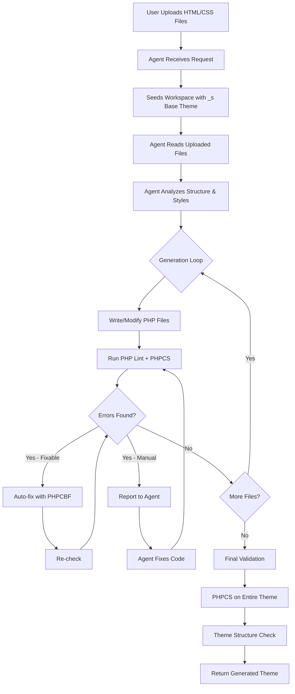
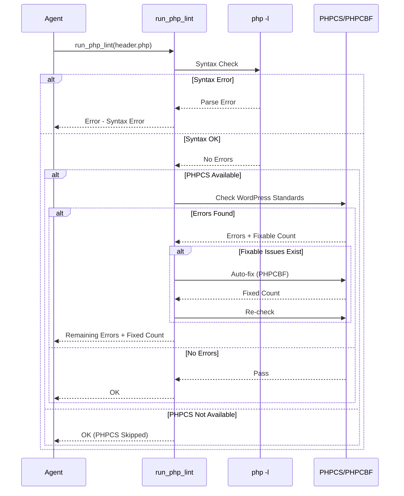

# WordPress Theme Generator

An AI-powered WordPress theme generator that converts HTML/CSS designs into fully functional WordPress themes using the Underscores (_s) starter theme as a foundation.

## Features

- Converts uploaded HTML/CSS files to WordPress themes
- Based on Underscores (_s) starter theme
- Automatic PHP linting with syntax validation
- WordPress coding standards validation via PHPCS (optional)
- Auto-fixes fixable coding standard issues
- ACF field generation for editable content areas

## Requirements

- Python 3.10+
- PHP 7.4+ (for linting)
- OpenAI-compatible API (Fireworks AI by default)

### Optional

- Composer
- PHPCS (PHP CodeSniffer) with WordPress Coding Standards

## Installation

### 1. Clone the Repository

```bash
git clone https://github.com/yourusername/wp-theme-gen.git
cd wp-theme-gen
```

### 2. Install Python Dependencies

Using uv (recommended):

```bash
uv sync
```

Using pip:

```bash
pip install -e .
```

### 3. Install PHP (Required for Linting)

**Ubuntu/Debian:**

```bash
sudo apt update
sudo apt install php-cli
```

**macOS:**

```bash
brew install php
```

**Windows:**

Download from https://www.php.net/downloads

### 4. Install PHPCS (Optional - for WordPress Coding Standards)

```bash
composer require wp-coding-standards/wpcs --dev
```

Or install globally:

```bash
composer global require wp-coding-standards/wpcs
```

### 5. Configure Environment

Create a `.env` file in the project root:

```env
FIREWORKS_API_KEY=your_api_key_here
```

## Running the Project

### Development Server

```bash
uv run uvicorn app.main:app --reload --port 8000
```

Or using Python directly:

```bash
python -m uvicorn app.main:app --reload --port 8000
```

### Access the Application

Open your browser and navigate to:

```
http://localhost:8000
```

## How the Agent Works

The theme generation process follows this workflow:



### Agent Tools

The agent has access to the following tools:

| Tool | Purpose |
|------|---------|
| `write_file` | Write content to theme files |
| `read_file` | Read uploaded or generated files |
| `list_files` | List workspace files |
| `copy_file` | Copy files without reading content (saves tokens) |
| `copy_section` | Extract sections using regex patterns |
| `search_in_file` | Search regex patterns in single files |
| `grep_workspace` | Search across all workspace files |
| `run_php_lint` | Check PHP syntax + WordPress coding standards |
| `list_base_theme_files` | List _s theme files |
| `read_base_theme_file` | Read _s theme file contents |
| `generate_acf_fields` | Create ACF field groups |

### Linting Flow



## Project Structure

```
wp-theme-gen/
├── app/
│   ├── __init__.py
│   ├── main.py              # FastAPI application
│   ├── api.py               # API routes
│   └── agent/
│       ├── __init__.py
│       ├── loop.py          # Main agent loop
│       ├── prompts/
│       │   ├── __init__.py
│       │   └── system_prompt.py
│       └── tools/
│           ├── __init__.py
│           ├── _paths.py    # Path resolution & security
│           ├── core.py      # Core file operations
│           ├── copy.py      # Copy operations
│           ├── search.py    # Search operations
│           ├── base_theme.py # _s theme operations
│           ├── acf.py       # ACF field generation
│           ├── phpcs_checker.py # PHPCS integration
│           └── schema.py    # Tool definitions for LLM
├── _s/                      # Underscores base theme
├── uploads/                 # User uploaded files
├── workspaces/              # Generated themes
├── run.py                   # Entry point
├── pyproject.toml           # Project configuration
└── README.md
```

## Configuration

### Environment Variables

| Variable | Description | Required |
|----------|-------------|----------|
| `FIREWORKS_API_KEY` | Fireworks AI API key | Yes |
| `PHP_PATH` | Custom PHP binary path | No |
| `PHPCS_PATH` | Custom PHPCS path | No |

### PHPCS Standards

The agent uses `WordPress-Core` standard by default. Available standards:

- `WordPress` - All WordPress rules
- `WordPress-Core` - Core coding standards (default)
- `WordPress-Docs` - Documentation standards
- `WordPress-Extra` - Extended best practices

## Troubleshooting

### PHP Not Found

Ensure PHP is installed and in your PATH:

```bash
php -v
```

### PHPCS Not Detected

Check PHPCS installation:

```bash
phpcs --version
phpcs -i  # List installed standards
```

### API Errors

Verify your API key in `.env`:

```bash
cat .env
```

## Contributing

1. Fork the repository
2. Create a feature branch
3. Make your changes
4. Run linting: `uv run ruff check app/`
5. Submit a pull request

## License

MIT License - see LICENSE file for details.
